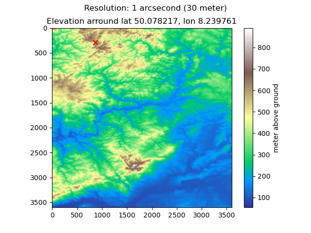

# Open Elevator
Open Elevator is a free elevation API with up to 3m global accuracy.
The API is publicly hosted for free at [https://opendata.predly.com/v1/elevation](https://opendata.predly.com/elevation/docs/).


API
```shell
$ curl https://opendata.predly.com/v1/elevation/json?lat=50.078217&lon=8.239761

{
  "elevation": 118.73242074762783,
  "location": {
    "lat": 50.078217,
    "lon": 8.239761
  }
}
```

### 1. Features
- OpenElevator Class
    - Retrieving and preprocessing of dataset
    - Builtin cache for elevation query within python
    - Builtin interpolation of elevation between grid points
    - Visualization of elevation for given locatio
- OpenElevator Web API
    - Single location lookup (GET request)
    - multiple location lookup
    - Builtin API cache
    - Builtin Rate Limiting

### 2. Performance
(Tested on a machine with Ryzen Epyc 32 Cores and 0.5 TB RAM on empty cache)

Request average: 22.21 ms @ 84k requests in 30seconds

    running (0m31.8s), 0000/5000 VUs, 84046 complete and 0 interrupted iterations
    default ✓ [======================================] 5000 VUs  30s

        data_received..................: 3.3 MB 103 kB/s
        data_sent......................: 2.1 MB 65 kB/s
        http_req_blocked...............: avg=1.24ms   min=0s       med=0s      max=536.8ms  p(90)=4.95µs   p(95)=6.14µs  
        http_req_connecting............: avg=1.11ms   min=0s       med=0s      max=276.99ms p(90)=0s       p(95)=0s      
        http_req_duration..............: avg=22.21ms  min=0s       med=0s      max=2s       p(90)=86.27ms  p(95)=141.39ms
        { expected_response:true }...: avg=113.01ms min=600.59µs med=87.86ms max=2s       p(90)=216.27ms p(95)=294.67ms
        http_req_failed................: 80.34% ✓ 67523       ✗ 16523 
        http_req_receiving.............: avg=414.08µs min=0s       med=0s      max=1.98s    p(90)=41.56µs  p(95)=68.35µs 
        http_req_sending...............: avg=1.2ms    min=0s       med=0s      max=1.31s    p(90)=20.65µs  p(95)=37.66µs 
        http_req_tls_handshaking.......: avg=0s       min=0s       med=0s      max=0s       p(90)=0s       p(95)=0s      
        http_req_waiting...............: avg=20.6ms   min=0s       med=0s      max=957.46ms p(90)=82.3ms   p(95)=134.58ms
        http_reqs......................: 84046  2639.131214/s
        iteration_duration.............: avg=1.83s    min=1s       med=1.72s   max=4.91s    p(90)=2.5s     p(95)=2.7s    
        iterations.....................: 84046  2639.131214/s
        vus............................: 2915   min=2915      max=5000
        vus_max........................: 5000   min=5000      max=5000

### 3. Visualization
```python
from PIL import Image
from openelevator import OpenElevator

elevator = OpenElevator()

# visualize a specific location
img = elevator.plot_elevation(lat=50.078217, lon=8.239761)
with Image.open(img) as im:
    im.show()
```


### 4. Set up your own [with this Tutorial](./docs/installation.md)

### 5, ToDos
- [ ] Add support for interpolation add tile edges
- [ ] Add routes for
        - max/min slope in area
        - height profile of given geojson
- [ ] add Dockerfile
- [ ] add Makefile
- [ ] update installation information
- [ ] check for free space

### Notes
Downloading could be speeded up if using a shared
client, but boto3 currently does not offer pickling
of its ressources (https://github.com/boto/boto3/issues/2741)

        

### Underlying dataset
[AWS Elevation tiles](https://registry.opendata.aws/terrain-tiles/)

# Important!!!

1. fastapi-limiter currently has a [bug that is not merged yet](https://github.com/hardbyte/fastapi-limiter/commit/1ef5b5bc59c8967c71d0ec802da6e6773798dee1) so the current project will
throw an exception!!!
