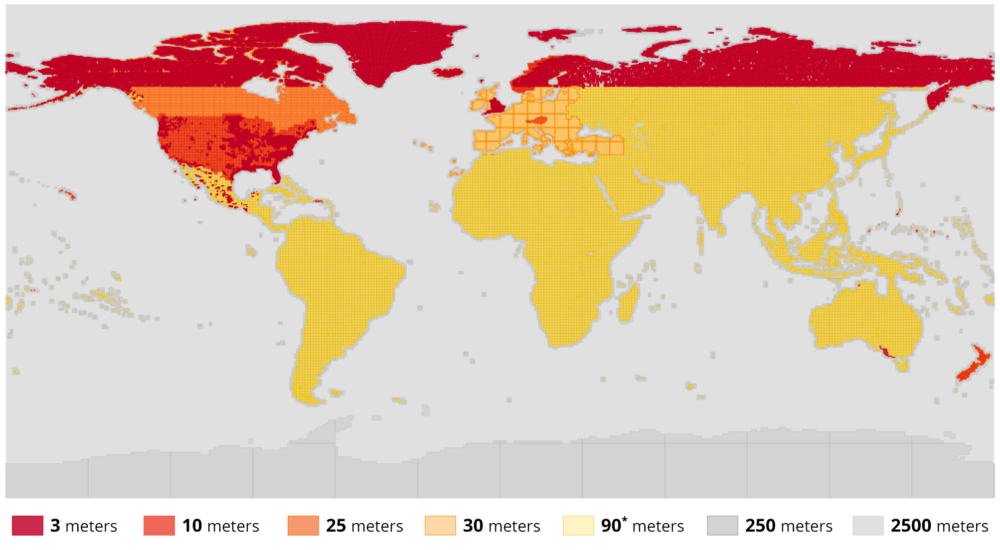

# Dataset

The data source is [Mapzen Terrain Tiles, provided by Amazon S3](https://registry.opendata.aws/terrain-tiles/).

As mentioned in the repo:
**Attribution is required** for some data providers. See the [Attribution](https://github.com/tilezen/joerd/blob/master/docs/attribution.md) document for more information.

## List of sources

The underlying data sources are a mix of:

- [3DEP](http://nationalmap.gov/elevation.html) (formerly NED and NED Topobathy) in the United States, 10 meters outside of Alaska, 3 meter in select land and territorial water areas
- [ArcticDEM](http://nga.maps.arcgis.com/apps/MapSeries/index.html?appid=cf2fba21df7540fb981f8836f2a97e25) strips of 5 meter mosaics across all of the land north of 60° latitude, including Alaska, Canada, Greenland, Iceland, Norway, Russia, and Sweden
- [CDEM](http://geogratis.gc.ca/api/en/nrcan-rncan/ess-sst/c40acfba-c722-4be1-862e-146b80be738e.html) (Canadian Digital Elevation Model) in Canada, with variable spatial resolution (from 20-400 meters) depending on the latitude.
- [data.gov.uk](http://environment.data.gov.uk/ds/survey/index.jsp#/survey), 2 meters over most of the United Kingdom
- [data.gv.at](https://www.data.gv.at/katalog/dataset/b5de6975-417b-4320-afdb-eb2a9e2a1dbf), 10 meters over Austria
- [ETOPO1](https://www.ngdc.noaa.gov/mgg/global/global.html) for ocean bathymetry, 1 arc-minute resolution globally
- [EUDEM](https://www.eea.europa.eu/data-and-maps/data/eu-dem#tab-original-data) in most of Europe at 30 meter resolution, including Albania, Austria, Belgium, Bosnia and Herzegovina, Bulgaria, Croatia, Cyprus, Czechia, Denmark, Estonia, Finland, France, Germany, Greece, Hungary, Iceland, Ireland, Italy, Kosovo, Latvia, Liechtenstein, Lithuania, Luxembourg, Macedonia, Malta, Montenegro, Netherlands, Norway, Poland, Portugal, Romania, Serbia, Slovakia, Slovenia, Spain, Sweden, Switzerland, and United Kingdom
- Geoscience Australia's [DEM of Australia](https://ecat.ga.gov.au/geonetwork/srv/eng/search#!22be4b55-2465-4320-e053-10a3070a5236), 5 meters around coastal regions in South Australia, Victoria, and Northern Territory
- [GMTED](http://topotools.cr.usgs.gov/gmted_viewer/) globally, coarser resolutions at 7.5", 15", and 30" in land areas
- [INEGI](http://en.www.inegi.org.mx/temas/mapas/relieve/continental/)'s continental relief in Mexico
- [Kartverket](http://data.kartverket.no/download/content/digital-terrengmodell-10-m-utm-33)'s Digital Terrain Model, 10 meters over Norway
- [LINZ](https://data.linz.govt.nz/layer/1768-nz-8m-digital-elevation-model-2012/), 8 meters over New Zealand
- [SRTM](https://lta.cr.usgs.gov/SRTM) globally except high latitudes, 30 meters (90 meters nominal quality) in land areas

[More Information](https://github.com/tilezen/joerd/blob/master/docs/data-sources.md)