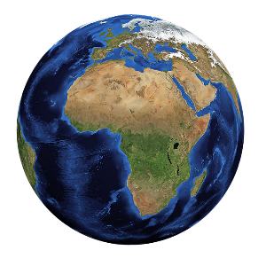

<div style="text-align:center">
    <h1 >Open Elevator API</h1>
    </img>
    <p style="text-align:center">
        <strong>Open Elevator API</strong> is an easy to use elevation service with up to 3m resolution.<br> <a href="#selfservice">Run your own</a> or use our free <a href="#free-api">public API</a>.
    </p>
</div>
---

## API example

### Single location

``` shell
$ curl http://localhost:8080/v1/elevation/json?lat=50.078217&lon=8.239761
```

``` json
{
  "elevation": 118.73242074762783,
  "location": {
    "lat": 50.078217,
    "lon": 8.239761
  }
}
```

### Multiple locations

```shell
$ curl -X 'POST' \
  'https://opendata.predly.com/v1/elevation/json' \
  -H 'accept: application/json' \
  -H 'Content-Type: application/json' \
  -d '{
  "locations": [
    [50,8],[50,9],[51,8]
  ],
  "interpolation": "linear"
}'
```

```json
{
  "results": [
    {
      "elevation": -32,
      "location": {
        "lat": 50,
        "lon": 8
      }
    },
    {
      "elevation": 397,
      "location": {
        "lat": 50,
        "lon": 9
      }
    },
    {
      "elevation": -3361,
      "location": {
        "lat": 51,
        "lon": 8
      }
    }
  ]
}
```

## Package example

```python
from PIL import Image
from openelevator import OpenElevator

elevator = OpenElevator()

# visualize a specific location
img = elevator.plot_elevation(lat=50.078217, lon=8.239761)
with Image.open(img) as im:
    im.show()
```
